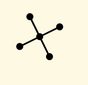

## Modifying next hop usage

The program takes three parameters as input.
  - `-s` or `--source` The source node in the topology
  - `-d` or `--dest` The destination node in the topology
  - `-r` or `--runtime` The runtime URL

Following is the sample usage of the following topology
<p align="center">
  
</p>

```
$ python ModifyNextHop.py -s node3 -d node1 -r http://localhost:8888
```

The above command prints the following output to the above shown topology, where `node5` is the switch(center) node in the topology

```
Updated next hop of   http://localhost:8888/services/node3  to   http://localhost:8888/services/node5
Updated next hop of   http://localhost:8888/services/node5  to   http://localhost:8888/services/node1
```
